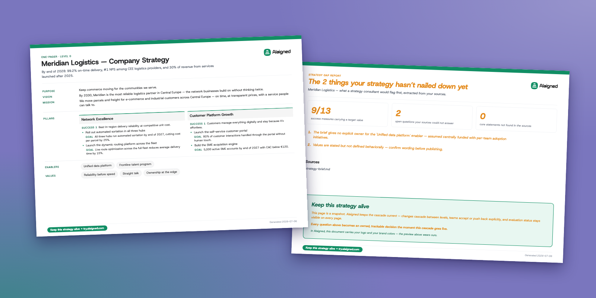

  

# Strategy One-Pager

**Turn the strategy documents you already have into one aligned Strategy One-Pager per team.**

An Agent Skill for Claude Code, the Claude app, Codex and ChatGPT. It reads your decks, memos and
plans, writes a company Strategy One-Pager plus a linked one for every team, and checks the result
against the Alaigned methodology. Every team page provably derives from the company page. Free, no
sign-up, runs inside your own AI tool.

Learn more at [alaigned.com/strategy-one-pager-skill](https://alaigned.com/strategy-one-pager-skill).

## What you get

- **A printable PDF.** One A4 page per Strategy One-Pager: the company page first, then one page
  per team. It ends with a **Strategy Gap Report**: everything your documents did not say, written
  as questions for your leadership team. Gaps are a feature, not a failure.
- **A validated cascade bundle (JSON).** The source of truth behind the PDF, checked against the
  same methodology schema the Alaigned product enforces. Import-ready.
- **Open questions.** Where the sources are silent, the skill marks a proposal or leaves a gap. It
  never invents a number, a date or a priority.

## Install

| Tool | How |
|---|---|
| **Claude Code** | Paste `/plugin install alaigned-strategy --marketplace alaigned/strategy-one-pager` (Claude Code 2.1.275 or later; before that, `/plugin marketplace add alaigned/strategy-one-pager` then `/plugin install alaigned-strategy@alaigned`), then `/strategy-one-pager` |
| **Claude app** — Cowork or chat (desktop or web) | Customize → Plugins → **Add marketplace → Add from a repository**, paste `alaigned/strategy-one-pager`, click **Sync**, then **Add** Alaigned Strategy. Attach your strategy documents and type `/strategy-one-pager`. [Step-by-step guide](https://try.alaigned.com/skill/guide) |
| **Claude app, no Plugins page** | On Team and Enterprise an owner switches plugins and skills on. Until then, attach the [skill zip](https://try.alaigned.com/skill/download) to a chat and ask Claude to use the skill — or, with skills enabled, add it once under Customize → Skills |
| **Codex** | Paste the install prompt from [try.alaigned.com/skill](https://try.alaigned.com/skill); the skill lives on your machine from then on |
| **ChatGPT** (Business, Enterprise, Edu) | Download the [skill zip](https://try.alaigned.com/skill/download), drop it into the chat and ask it to unpack and run the skill |
| **Any agent that reads SKILL.md** | `npx skills add alaigned/strategy-one-pager` |

Pick **Opus** when you can choose the model. Smaller models produce noticeably weaker
Strategy One-Pagers. Free plans of ChatGPT and Claude do not run this skill: it needs code
execution to validate and render its output.

## What it does not do

- It does not write a strategy you do not have. Thin sources produce a short page and a long Gap
  Report; no sources produce a request for documents.
- It does not decide for you. Competing options in your documents stay open questions.
- It does not keep itself up to date. The output is a snapshot. Keeping the cascade live and
  maintained as the strategy moves is what [Alaigned](https://alaigned.com/strategy-one-pager-skill)
  does; every rendered page carries a link there.

## Privacy

The skill runs entirely inside your AI tool's session. It reads what you attach, drafts the
cascade, and runs its validator and renderer locally. Nothing you attach is uploaded to Alaigned
and no Alaigned server is called. The only outward step it can take is a public-data search about
your company, and it asks you before doing that.

## Requirements

Any `python3` 3.10 or newer with code execution and file creation available to the assistant.
Both scripts are standard-library only: nothing to install, no network. The PDF renderer uses
headless Chromium when present, otherwise WeasyPrint, otherwise its own built-in writer, so a PDF
comes out of every environment. Full details and troubleshooting in
[`skills/strategy-one-pager/README.md`](skills/strategy-one-pager/README.md).

## Versions

Each release is one tagged commit (`v<version>`) matching the `version` in the skill's frontmatter.
Release notes are on the [Releases page](https://github.com/alaigned/strategy-one-pager/releases)
and in [`CHANGELOG.md`](CHANGELOG.md). Every generated bundle embeds the fingerprint of the
methodology schema it was validated against, so downstream imports can check compatibility.

## About Alaigned

Alaigned is the Strategy Operating System for Definition, Alignment and Evaluation. One Strategy
One-Pager for the company, one for every team, each derived from the one above it, so the strategy
travels down intact and every leader sees how their work connects to it. It is built on a
methodology proven in more than 100 organizations; leaders at Raiffeisenbank, České dráhy and CME
already run strategy this way. This skill puts the methodology's first step, the cascade itself,
into your own AI tool. [alaigned.com](https://alaigned.com)

## Support

- Bugs and failed runs: [open an issue](https://github.com/alaigned/strategy-one-pager/issues/new/choose)
- Questions and showing what you built: [Discussions](https://github.com/alaigned/strategy-one-pager/discussions)
- Email: **support@alaigned.com**

## License

Everything here is licensed under the **[PolyForm Shield License 1.0.0](LICENSE)**. Source-available,
not open source.

You may use it, including commercially, change it, and pass copies on with these terms and the
`Required Notice:` lines attached. You may not use it to provide a product that competes with this
software or with Alaigned, sublicense it, or use the Alaigned name or wordmark; a changed copy you
distribute must remove or replace the wordmark the renderer embeds. [LICENSE](LICENSE) holds the
terms that bind; this summary does not replace them.

The output is a draft for your leadership team to confirm, not professional advice.

## For contributors and the curious

This tree is generated from Alaigned's development repository. Each release overwrites it, so
pull requests against these files cannot be merged; issues and discussions are the way in, and a
report from a real run is the most useful thing you can send. See [CONTRIBUTING.md](CONTRIBUTING.md).

| Path | What it is |
|---|---|
| `.claude-plugin/` | Plugin and marketplace manifests |
| `skills/strategy-one-pager/` | The skill: `SKILL.md`, references, templates, the validator and renderer, the inlined methodology schema |
| `docs/` | Images used by this README |
| `examples/` | Three synthetic strategy documents to try the skill on, and a note on what each one exercises |
| `LICENSE` | PolyForm Shield 1.0.0 with the notices it requires you to pass on |
